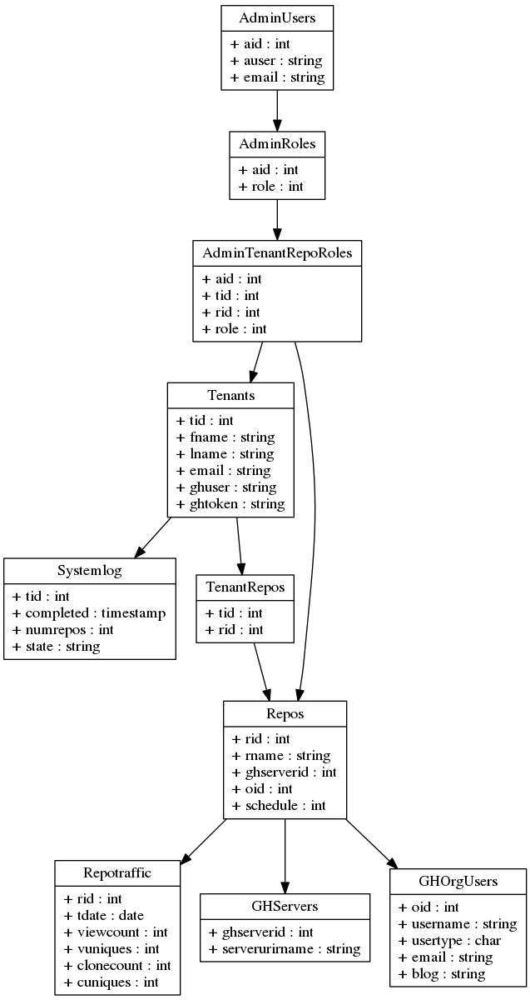

# Github Traffic Analytics: Combining serverless and Cloud Foundry for data retrieval and analytics
This repository contains the code for an [IBM Cloud solution tutorial](https://console.bluemix.net/docs/tutorials/serverless-github-traffic-analytics.html). In the tutorial, we create an application to automatically collect Github traffic statistics for repositories and provide the foundation for traffic analytics. Github only provides access to the traffic data for the last 14 days. If you want to analyze statistics over a longer period of time, you need to download and store that data yourself. The app and the serverless action discussed in this tutorial implement a multi-tenant-ready solution to manage repositories, automatically collect traffic data on a daily or weekly schedule, and to view and analyze the collected data.

Related blogs:
* [Tutorial: GitHub Traffic Analytics with Cloud Functions and Cloud Foundry](https://www.ibm.com/blogs/bluemix/2018/04/tutorial-github-traffic-analytics/)
* [Use Db2 and IBM Cloud to analyze GitHub traffic data (tutorial)](http://blog.4loeser.net/2018/04/use-db2-and-ibm-cloud-to-analyze-github.html)
* [Automated, regular database jobs with IBM Cloud Functions (and Db2)](http://blog.4loeser.net/2018/04/automated-regular-database-jobs-with.html)

# Files in this repository
The files in this repository have the following structure:
* [backend](backend): Has the code for the Python-based server app, using the Flask framework
* [functions](functions): Code for IBM Cloud Functions which is used for the automatic collection of the Github traffic data

Important files in the **backend** directory:
* [ghstats.py](backend/ghstats.py): Flask app to manage repositories and their traffic data
* [database.sql](backend/database.sql): SQL script (for Db2) which is read and executed by the app during initialization.
* [manifest.yml](backend/manifest.yml): Manifest file to simplify app deployment, contains service bindings
* [requirements.in](backend/requirements.in): Input file for automatically generating the requirements file using **pip-compile**
* [config.json.sample](backend/config.json.sample): Sample configuration file for testing the app locally. The service credentials can be taken from the service keys or obtain in the IBM Cloud console.
* [dashboard.json](backend/dashboard.json): Canned (pre-created) dashboard to use with the IBM Dynamic Dashboard Embedded service. It is adapted at runtime.

Important files in the **functions** directory:
* [__main__.py](functions/__main__.py): Code for Cloud Functions action, written in Python, uses the Github v3 API
* ghstats.zip: Zip archive with the action code and the githubpy module included. The zip archive is used to create the action.

The database schema, defined in [database.sql](backend/database.sql), can be graphically represented as (source in [Graphviz DOT notation](https://www.graphviz.org/documentation/) in [dbschema.gv.txt](dbschema.gv.txt)):

# Create or change embedded dashboards
An additional dashboard specification is available in file [dashboard2.json](backend/dashboard2.json). It allows to render charts like shown in the two screenshots below. Either copy the file to `dashboard.json` and use it instead of the default dashboard or modify the code to select from given dashboards.   
Once you created a dashboard on your own, you can export the specification and copy it into a new file, similar to `dashboard2.json`. The app code automatically replaces the data source URL and the authentication token.

# License
See [LICENSE](LICENSE) for license information.

# Contribute / Contact Information
If you have found errors or some instructions are not working anymore, then please open an GitHub issue or, better, create a pull request with your desired changes.

You can find more tutorials and sample code at:
https://console.bluemix.net/docs/tutorials/index.html
